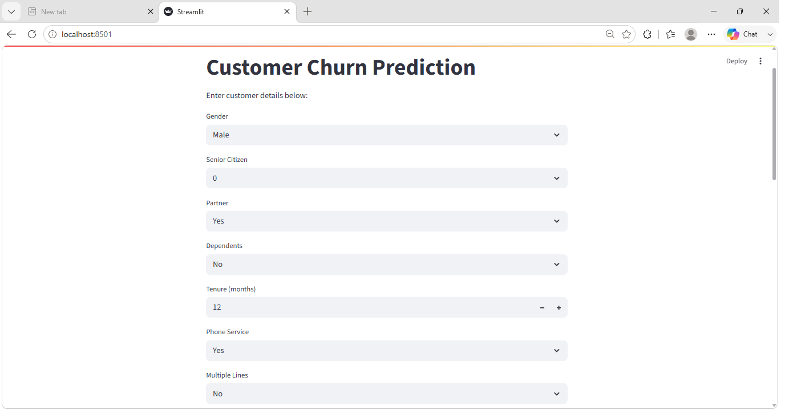

# KarmixTech_CustomerChurnPrediction

## Project Overview

Predict whether a telecom customer is likely to churn.

## Business Problem

Customer churn negatively impacts revenue and customer acquisition costs.

## Dataset

Telco Customer Churn Dataset

## Project Workflow

- Data Cleaning
- EDA
- Feature Engineering
- Logistic Regression
- Random Forest
- XGBoost
- Model Evaluation

## Model Results

| Model | Accuracy | ROC-AUC |
|---------|---------|---------|
| Logistic Regression | 82.04% | 0.8620 |
| Random Forest | 79.13% | 0.8402 |
| XGBoost | 81.41% | 0.8610 |

## Business Insights

- Longer tenure reduces churn.
- Two-year contracts improve retention.
- Fiber Optic users show higher churn.
- Electronic check users are higher risk.
- Security and support services improve retention.

## Recommendations

- Promote long-term contracts.
- Focus on new customers.
- Encourage auto-pay adoption.
- Increase support-service adoption.

## Deployment

Streamlit Application

##HomeScreen Screenshots

## Author

Sahil Shah
